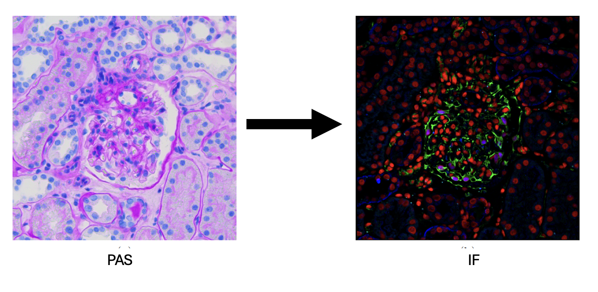
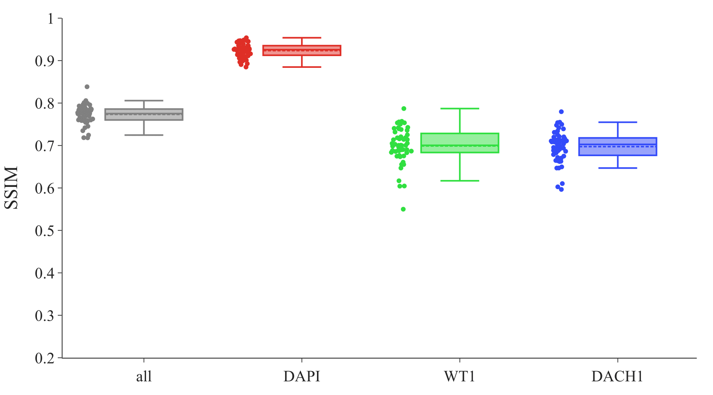
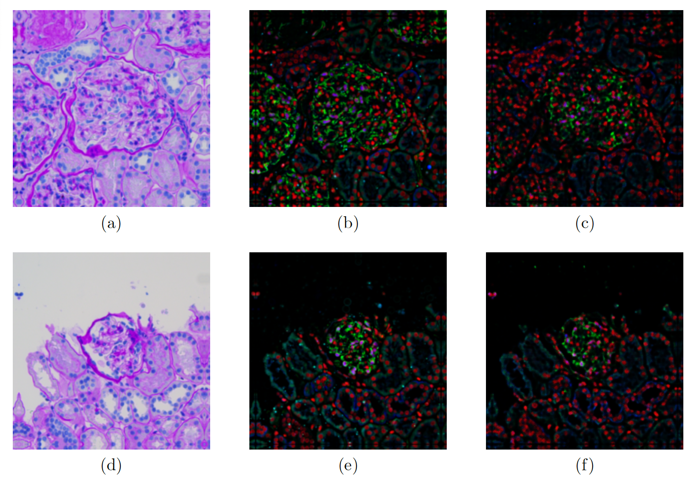
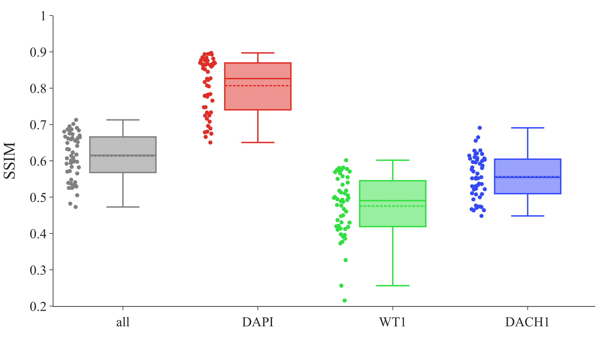

# Virtual staining of microscopy images obtained from renal biopsies- PAS2IF

**VirtualStain-PAS2IF** is a repository dedicated to the development and comparison of virtual staining techniques for immunofluorescence (IF) in renal pathology. Traditional pathological examination, which involves the physical staining of tissue samples, remains the gold standard for diagnosing many systemic diseases. However, this process can be resource- and labor-intensive, as staining is typically done manually by trained experts.



This project explores virtual staining as a cost-effective and time-efficient alternative by translating periodic acid-Schiff (PAS) stained images of renal biopsy samples into images with three IF markers: DAPI, WT1, and DACH1. By using both supervised and unsupervised image-to-image translation methods—specifically, the **pix2pix** and **cycleGAN** architectures—this project evaluates the effectiveness of virtual staining for potential applications in diagnostics and research.

## Results

In conclusion, the results of this thesis demonstrate that the supervised image-to-image translation approach (pix2pix) is more effective than the unsupervised approach (cycleGAN) for the task of virtual staining. The supervised model was able to leverage the paired training data to learn a direct mapping from PAS images to IF-stained representations with higher accuracy and consistency than the cycleGAN model. This is likely due to the nature of supervised learning, which allows the model to access precise, paired information between PAS and IF images during training. In contrast, cycleGAN’s unsupervised method lacks this alignment and instead relies on cycle consistency, making it less effective when fine-grained molecular-level details are required.

The success with DAPI, an IF marker used to stain DNA, is particularly noteworthy. PAS staining, which highlights general tissue structure, appears to provide sufficient information to accurately infer DAPI staining. This suggests that, for some markers, PAS images may contain adequate structural cues that allow the model to approximate specific molecular features. DAPI, being a widely used nuclear stain, is potentially more aligned with the structural detail captured in PAS images, facilitating accurate virtual staining results.

However, the model encountered challenges with WT1 and DACH1, which target podocyte cytoplasm and nuclei, respectively. These markers may require more complex molecular information that is not readily captured by PAS staining alone. WT1 and DACH1 are specialized markers for podocytes, and the lack of sufficient molecular specificity in PAS images may contribute to the limited performance seen with these markers. This limitation underscores the fact that structural staining alone (like PAS) may not fully encapsulate the nuanced biochemical information needed for markers targeting specific cell types or intracellular components.


Pix2pix: Boxplot showing SSIM values of RGB channels: Shown are the SSIM values of all images of the test set. The images were generated with the L1 pix2pix variant. A separation is provided between the SSIM values of the markers DAPI (red channel), WT1 (green channel) and DACH1 (blue channel). All channels together are shown in gray.


Pix2pix L1: worst and best example of virtually stained images: Shown are the images with the worst (a-c) and the best (d-f) SSIM taken from the best pix2pix variant L1. In each line, the original PAS images (a),(d) are displayed first. This is followed by the original IF image (b),(e). On the right (c), (f), the generated IF image is shown.


CycleGAN: Boxplot showing SSIM values of RGB channels: Shown are the SSIM values of all images of the test set. The images were generated with the vanilla cycleGAN variant. A separation is provided between the SSIM values of the markers DAPI (red channel), WT1 (green channel) and DACH1 (blue channel). All channels together are shown in gray.


CycleGAN: worst and best example of virtually stained images: Shown are the images with the worst (a-c) and the best (d-f) SSIM taken from the cycleGAN approach. In each line, the real IF images (a),(d) are displayed first. (b),(e) are the generated IF image of the vanilla variant and   (c),(f) the generated and merged IF image of the patch variant.

## Project Overview

1. **Data**: The dataset contains 1,148 paired images of kidney tissue sections stained with both PAS and IF markers. Accurate image registration was applied to ensure pixel-precise alignment.

2. **Methods**: Two neural network approaches were used for image-to-image translation:
   - **Supervised (pix2pix)**: Includes modifications to the L1 loss function for improved accuracy in translating PAS images to each IF marker.
   - **Unsupervised (cycleGAN)**: Used for comparison, with variations in image resolution and loss functions tested.

3. **Evaluation**: The quality of generated IF images was evaluated using multiple metrics:
   - **Mean Absolute Error (MAE)**
   - **Structural Similarity Index Measure (SSIM)**
   - **Fréchet Inception Distance (FID)**
   - **Dice Score** for segmentation accuracy compared to expert annotations.

4. **Results**: The supervised pix2pix model with enhanced loss function and higher resolution yielded the most accurate virtual IF images. DAPI staining was achieved effectively, though virtual staining for WT1 and DACH1 proved more challenging.

## Goals

This project seeks to advance virtual staining techniques for clinical and research applications by evaluating different deep learning approaches to translate PAS-stained images to IF-stained images. The findings suggest that supervised approaches may hold promise for further development in automated pathology.

## Methods

### Network Architecture

CycleGANs consist of two discriminators and two generator while pix2pix only needs one generator and discriminator.
For both approaches, the same network architectures were used for the generator and discriminator. A schematic illustration of the architectures:


The architecture of the generator (a) and the discriminator (b) used in the implemented approaches, pix2pix and cycleGAN, are shown. Adapted after Thebille (2020). The arrows represent the operations performed in each case:

- **$\color{black}{\longrightarrow}$ Conv, ReLU**
- **$\color{YellowOrange}{\longrightarrow}$ Copy**
- **$\color{red}{\longrightarrow}$ Conv, Tanh**
- **$\color{OliveGreen}{\longrightarrow}$ Up Conv, ReLU**
- **$\color{Mulberry}{\longrightarrow}$ Conv, Leaky ReLU**
- **$\color{LimeGreen}{\longrightarrow}$ Conv**

The generator is a U-Net adapted from Ronneberger [(2015)](https://arxiv.org/abs/1505.04597). It consists of an encoder, a transformer, and a decoder.
The encoder comprises three convolutional layers (Conv) to decrease the image dimensions while increasing the number of feature maps. All convolutional layers have a stride of two with a kernel size of three, apart from the first layer. It has a kernel size of seven with a stride of one. Hence, there is no reduction of the image dimension, but an increase of the feature channels to 64, as shown in Figure \ref{figure:NEtwort architecture}. In order to avoid a reduction in the size of the output due to convolution, when the kernel extends beyond the input at some calculation points, constant padding takes place automatically.

Each convolutional layer is followed by instance normalization and a ReLU activation.
The encoder is followed by the transformer, which consists of nine ResNet blocks. Each of the ResNet blocks comprises two convolutional layers, also followed by instance normalization and a ReLU activation. The decoder follows at last, which corresponds to the encoder in mirrored form. The decoder consists of transpose convolutional layers (ConvUp) which increase the input size and decrease the number of feature layers with the intention of producing an RGB image in the end. The transpose convolutional layers have a kernel size of three and a stride of two followed by instance normalization and ReLU activation, except for the last layer which has a kernel size of seven and a stride of one. Also the activation of the last layer differs. A tanh activation is used to ensure that the values range between -1 and 1. Skip-connections between layers of the same size, are located between encoder and decoder. The outputs of convolutional layers of the encoder are copied and concatenated with those of the decoder. The discriminator is a PatchGAN.  It consists of six convolutional layers with a kernel size of four followed by instance normalization and leaky ReLU activation with an alpha slope of 0.2. The first four layers have a stride of two and the last two a stride of one. The last layer has no normalization or activation, as it returns the result whether the image is fake or real.

## State of the art

Overview of published virtual staining attempts using histopathological data sets. The attempts are divided according to whether the original tissue was prestained or unstained. The approach used to virtually stain the images is specified in the column   ‘Approach’. The column ‘Data’ shows the start and target domain. AF refers to autofluorescence images. H\&E are images of tissue stained with hematoxylin and eosin. UV refers to ultraviolet radiation images and IF to immunoflurecence images. BF is the abbreviation for unstained images recorded by bright-field microscopy, G for Giemsa-stained images, and P for Papanicolaou-stained images.
The ‘Evaluation’ column indicates whether the generated images were evaluated using an objective method. The structural similarity index measure (SSIM), discussed in more detail in this Section, \ref{subsection:SSIM} was used in all studies that used objective metrics. The SSIM compares the generated image to the real image. A value of 1 is the best possible. The SSIM values achieved in the different studies are displayed. If paired images were not available, the SSIM could not be calculated and the assessment was made subjectively by pathologists or other experts.

| **Tissue Type**          | **Approach**  | **Data**           | **Evaluation**               |
|--------------------------|---------------|---------------------|------------------------------|
| **Unstained tissue**     |               |                     |                              |
| Rivenson et al. [(2019)](https://dx.doi.org/10.1038/s41551-019-0362-y)  | pix2pix      | AF → H&E            | by pathologists              |
| Boktor et al. [(2022)](https://www.nature.com/articles/s41598-022-14042-y)    | pix2pix      | AF → H&E            | SSIM: 0.91 ± 0.02           |
| Zhang et al. [(2022)](https://pubmed.ncbi.nlm.nih.gov/34622424/)     | pix2pix      | BF → H&E            | SSIM: 0.59                  |
| Soltani et al. [(2022)](https://www.nature.com/articles/s41598-022-13332-9)   | cycleGAN     | UV → H&E            | by pathologists              |
| **Prestained tissue**    |               |                     |                              |
| Chang et al. [(2018)](https://dx.doi.org/10.1117/12.2293249)     | pix2pix      | H&E → IF            | SSIM: 0.74 ± 0.11           |
| Teramoto et al. [(2021)](https://pubmed.ncbi.nlm.nih.gov/33718644/)   | cycleGAN     | G → P               | by pathologists              |

# Reproducibility

- Clone git reposetory

    ```bash
    git clone https://github.com/LauraWenderoth/immunofluorescence-virtual-staining.git
    cd Single_Cell_Sorter
    ```

- create conda environment and install requerments

    ```bash
    conda create --name env_vs python=3.8
    conda activate env_vs
    pip install -r requirements.txt
    ```

- Train and eval model

    ```bash
    python train.py
    python test.py
    ```

- Dataset: The data set consists of 2D microscopy images of stained tissue sections obtained from kidney biopsies. The data set was generated by the members of the Complex Tissue Analysis Group of the nephrology department (III. Medizinische Klinik und Poliklinik) and the Institute of Medical Systems Biology of the Universitätsklinikum Hamburg-Eppendorf (UKE) and is not publicly accessible.
